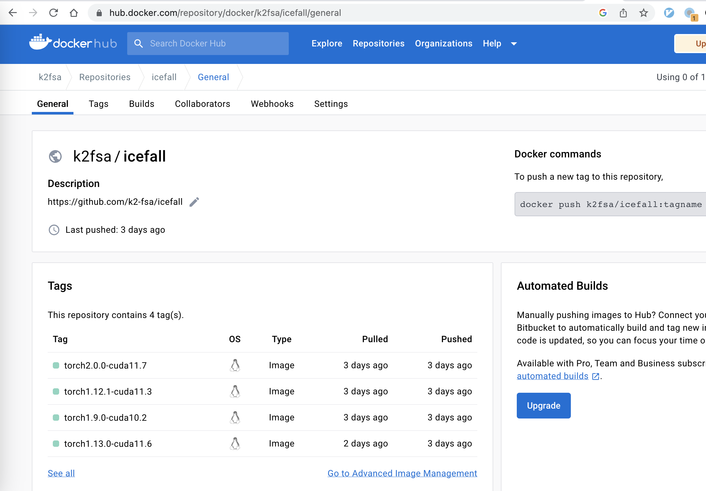

Introduction
=============

We have pre-built docker images hosted at the following address:

  `<https://hub.docker.com/repository/docker/k2fsa/icefall/general>`_

You can find the ``Dockerfile`` at `<https://github.com/k2-fsa/icefall/tree/master/docker>`_.

We describe the following items in this section:

  - How to view available tags
  - How to download pre-built docker images
  - How to run the `yesno`_ recipe within a docker container on ``CPU``

View available tags
===================

CUDA-enabled docker images
--------------------------

You can use the following command to view available tags for CUDA-enabled
docker images:

.. code-block:: bash

   curl -s 'https://registry.hub.docker.com/v2/repositories/k2fsa/icefall/tags/'|jq '."results"[]["name"]'

which will give you something like below:

.. code-block:: bash

  "torch2.4.1-cuda12.4"
  "torch2.4.1-cuda12.1"
  "torch2.4.1-cuda11.8"
  "torch2.4.0-cuda12.4"
  "torch2.4.0-cuda12.1"
  "torch2.4.0-cuda11.8"
  "torch2.3.1-cuda12.1"
  "torch2.3.1-cuda11.8"
  "torch2.2.2-cuda12.1"
  "torch2.2.2-cuda11.8"
  "torch2.2.1-cuda12.1"
  "torch2.2.1-cuda11.8"
  "torch2.2.0-cuda12.1"
  "torch2.2.0-cuda11.8"
  "torch2.1.0-cuda12.1"
  "torch2.1.0-cuda11.8"
  "torch2.0.0-cuda11.7"
  "torch1.12.1-cuda11.3"
  "torch1.9.0-cuda10.2"
  "torch1.13.0-cuda11.6"

.. hint::

   Available tags will be updated when there are new releases of `torch`_.

Please select an appropriate combination of `torch`_ and  CUDA.

CPU-only docker images
----------------------

To view CPU-only docker images, please visit `<https://github.com/k2-fsa/icefall/pkgs/container/icefall>`_
for available tags.

You can select different combinations of ``Python`` and ``torch``. For instance,
to select ``Python 3.8`` and ``torch 2.1.2``, you can use the following tag

.. code-block:: bash

    cpu-py3.8-torch2.1.2-v1.1

where ``v1.1`` is the current version of the docker image. You may see
``ghcr.io/k2-fsa/icefall:cpu-py3.8-torch2.1.2-v1.2`` or some other versions.
We recommend that you always use the latest version.

Download a docker image (CUDA)
==============================

Suppose that you select the tag ``torch1.13.0-cuda11.6``, you can use
the following command to download it:

.. code-block:: bash

   sudo docker image pull k2fsa/icefall:torch1.13.0-cuda11.6

Download a docker image (CPU)
==============================

Suppose that you select the tag ``cpu-py3.8-torch2.1.2-v1.1``, you can use
the following command to download it:

.. code-block:: bash

  sudo docker pull ghcr.io/k2-fsa/icefall:cpu-py3.8-torch2.1.2-v1.1

Run a docker image with GPU
===========================

.. code-block:: bash

  sudo docker run --gpus all --rm -it k2fsa/icefall:torch1.13.0-cuda11.6 /bin/bash

Run a docker image with CPU
===========================

.. code-block:: bash

  sudo docker run --rm -it ghcr.io/k2-fsa/icefall:cpu-py3.8-torch2.1.2-v1.1 /bin/bash

Run yesno within a docker container
===================================

After starting the container, the following interface is presented:

.. code-block:: bash

  # GPU-enabled docker
  root@60c947eac59c:/workspace/icefall#

  # CPU-only docker
  root@60c947eac59c:# mkdir /workspace; git clone https://github.com/k2-fsa/icefall
  root@60c947eac59c:# export PYTHONPATH=/workspace/icefall:$PYTHONPATH

It shows the current user is ``root`` and the current working directory
is ``/workspace/icefall``.

Update the code
---------------

Please first run:

.. code-block:: bash

  root@60c947eac59c:/workspace/icefall# git pull

so that your local copy contains the latest code.

Data preparation
----------------

Now we can use

.. code-block:: bash

  root@60c947eac59c:/workspace/icefall# cd egs/yesno/ASR/

to switch to the ``yesno`` recipe and run

.. code-block:: bash

  root@60c947eac59c:/workspace/icefall/egs/yesno/ASR# ./prepare.sh

.. hint::

   If you are running without GPU with a GPU-enabled docker, it may report the following error:

    .. code-block:: bash

        File "/opt/conda/lib/python3.9/site-packages/k2/__init__.py", line 23, in <module>
          from _k2 import DeterminizeWeightPushingType
        ImportError: libcuda.so.1: cannot open shared object file: No such file or directory

  We can use the following command to fix it:

    .. code-block:: bash

      root@60c947eac59c:/workspace/icefall/egs/yesno/ASR# ln -s /opt/conda/lib/stubs/libcuda.so /opt/conda/lib/stubs/libcuda.so.1

The logs of running ``./prepare.sh`` are listed below:

.. literalinclude:: ./log/log-preparation.txt

Training
--------

After preparing the data, we can start training with the following command

.. code-block:: bash

  root@60c947eac59c:/workspace/icefall/egs/yesno/ASR# ./tdnn/train.py

All of the training logs are given below:

.. hint::

   It is running on CPU and it takes only 16 seconds for this run.

.. literalinclude:: ./log/log-train-2023-08-01-01-55-27

Decoding
--------

After training, we can decode the trained model with

.. code-block:: bash

  root@60c947eac59c:/workspace/icefall/egs/yesno/ASR# ./tdnn/decode.py

The decoding logs are given below:

.. code-block:: bash

  2023-08-01 02:06:22,400 INFO [decode.py:263] Decoding started
  2023-08-01 02:06:22,400 INFO [decode.py:264] {'exp_dir': PosixPath('tdnn/exp'), 'lang_dir': PosixPath('data/lang_phone'), 'lm_dir': PosixPath('data/lm'), 'feature_dim': 23, 'search_beam': 20, 'output_beam': 8, 'min_active_states': 30, 'max_active_states': 10000, 'use_double_scores': True, 'epoch': 14, 'avg': 2, 'export': False, 'feature_dir': PosixPath('data/fbank'), 'max_duration': 30.0, 'bucketing_sampler': False, 'num_buckets': 10, 'concatenate_cuts': False, 'duration_factor': 1.0, 'gap': 1.0, 'on_the_fly_feats': False, 'shuffle': False, 'return_cuts': True, 'num_workers': 2, 'env_info': {'k2-version': '1.24.3', 'k2-build-type': 'Release', 'k2-with-cuda': True, 'k2-git-sha1': '4c05309499a08454997adf500b56dcc629e35ae5', 'k2-git-date': 'Tue Jul 25 16:23:36 2023', 'lhotse-version': '1.16.0.dev+git.7640d663.clean', 'torch-version': '1.13.0', 'torch-cuda-available': False, 'torch-cuda-version': '11.6', 'python-version': '3.9', 'icefall-git-branch': 'master', 'icefall-git-sha1': '375520d-clean', 'icefall-git-date': 'Fri Jul 28 07:43:08 2023', 'icefall-path': '/workspace/icefall', 'k2-path': '/opt/conda/lib/python3.9/site-packages/k2/__init__.py', 'lhotse-path': '/opt/conda/lib/python3.9/site-packages/lhotse/__init__.py', 'hostname': '60c947eac59c', 'IP address': '172.17.0.2'}}
  2023-08-01 02:06:22,401 INFO [lexicon.py:168] Loading pre-compiled data/lang_phone/Linv.pt
  2023-08-01 02:06:22,403 INFO [decode.py:273] device: cpu
  2023-08-01 02:06:22,406 INFO [decode.py:291] averaging ['tdnn/exp/epoch-13.pt', 'tdnn/exp/epoch-14.pt']
  2023-08-01 02:06:22,424 INFO [asr_datamodule.py:218] About to get test cuts
  2023-08-01 02:06:22,425 INFO [asr_datamodule.py:252] About to get test cuts
  2023-08-01 02:06:22,504 INFO [decode.py:204] batch 0/?, cuts processed until now is 4
  [W NNPACK.cpp:53] Could not initialize NNPACK! Reason: Unsupported hardware.
  2023-08-01 02:06:22,687 INFO [decode.py:241] The transcripts are stored in tdnn/exp/recogs-test_set.txt
  2023-08-01 02:06:22,688 INFO [utils.py:564] [test_set] %WER 0.42% [1 / 240, 0 ins, 1 del, 0 sub ]
  2023-08-01 02:06:22,690 INFO [decode.py:249] Wrote detailed error stats to tdnn/exp/errs-test_set.txt
  2023-08-01 02:06:22,690 INFO [decode.py:316] Done!

Congratulations! You have finished successfully running `icefall`_ within a docker container.
