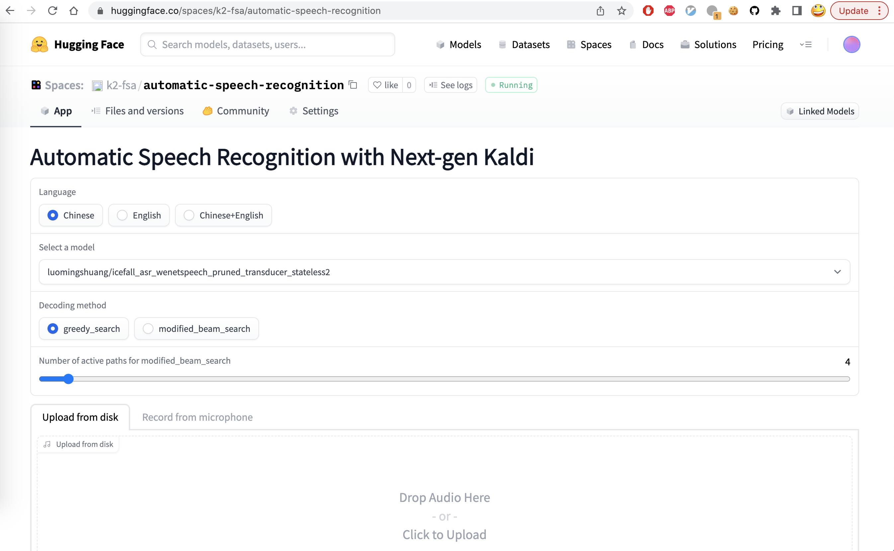
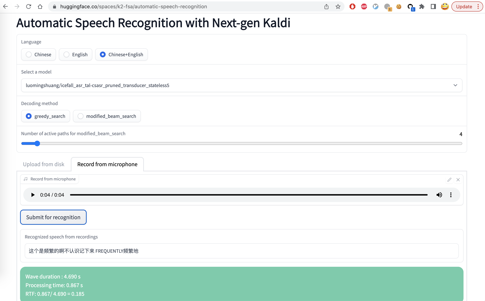
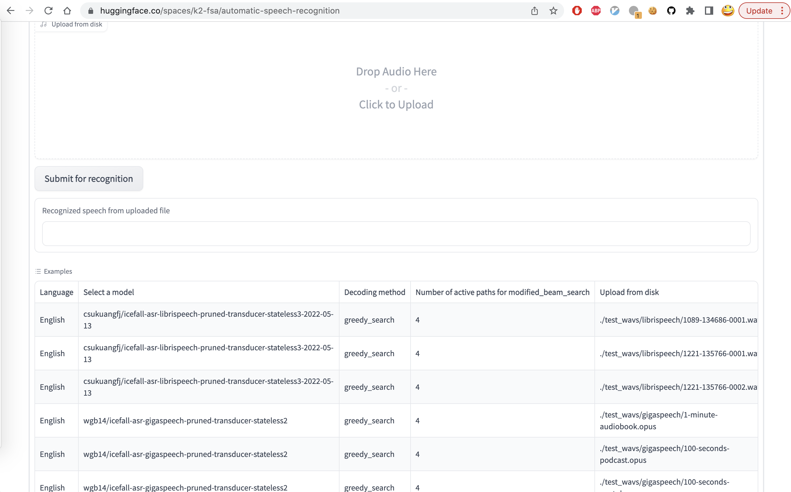

Huggingface spaces
==================

We have integrated the server framework
`sherpa <http://github.com/k2-fsa/sherpa>`_
with `Huggingface spaces <https://huggingface.co/spaces/k2-fsa/automatic-speech-recognition>`_
so that you can try pre-trained models from within your browser
without the need to download or install anything.

All you need is a browser, which can be run on Windows, macOS, Linux, or even on your
iPad and your phone.

Start your browser and visit the following address:

`<https://huggingface.co/spaces/k2-fsa/automatic-speech-recognition>`_

and you will see a page like the following screenshot:

You can:

  1. Select a language for recognition. Currently, we provide pre-trained models
     from ``icefall`` for the following languages: ``Chinese``, ``English``, and
     ``Chinese+English``.
  2. After selecting the target language, you can select a pre-trained model
     corresponding to the language.
  3. Select the decoding method. Currently, it provides ``greedy search``
     and ``modified_beam_search``.
  4. If you selected ``modified_beam_search``, you can choose the number of
     active paths during the search.
  5. Either upload a file or record your speech for recognition.
  6. Click the button ``Submit for recognition``.
  7. Wait for a moment and you will get the recognition results.

The following screenshot shows an example when selecting ``Chinese+English``:

In the bottom part of the page, you can find a table of examples. You can click
one of them and then click ``Submit for recognition``.

YouTube Video
-------------

We provide the following YouTube video demonstrating how to use
`<https://huggingface.co/spaces/k2-fsa/automatic-speech-recognition>`_.

.. note::

   To get the latest news of `next-gen Kaldi <https://github.com/k2-fsa>`_, please subscribe
   the following YouTube channel by `Nadira Povey <https://www.youtube.com/channel/UC_VaumpkmINz1pNkFXAN9mw>`_:

      `<https://www.youtube.com/channel/UC_VaumpkmINz1pNkFXAN9mw>`_

..  youtube:: ElN3r9dkKE4
