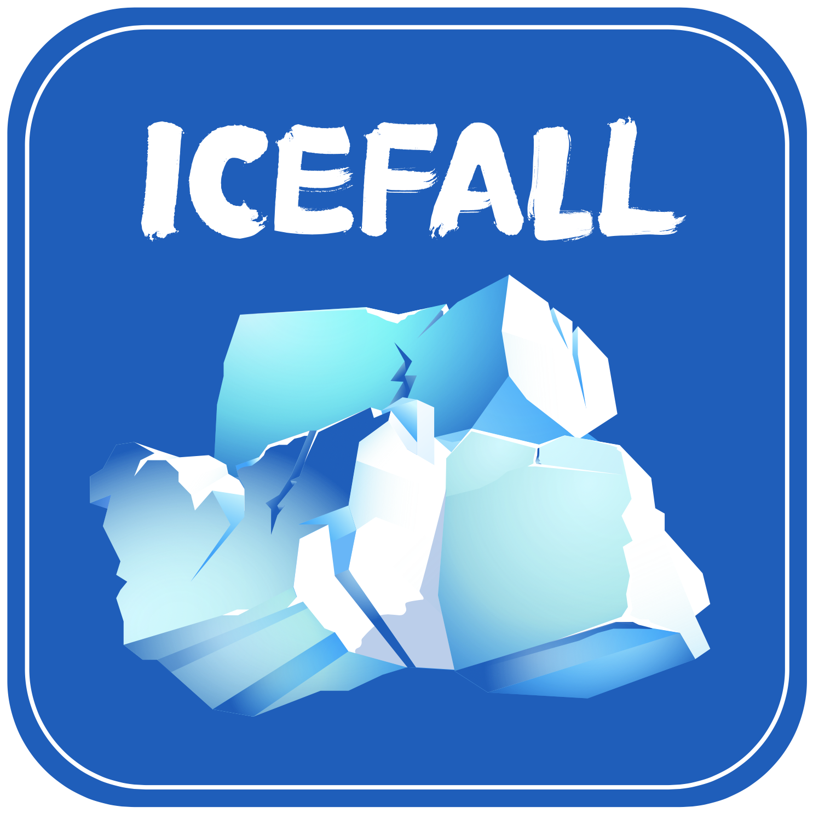

.. icefall documentation master file, created by
   sphinx-quickstart on Mon Aug 23 16:07:39 2021.
   You can adapt this file completely to your liking, but it should at least
   contain the root `toctree` directive.

Icefall
=======

Documentation for `icefall <https://github.com/k2-fsa/icefall>`_, containing
speech recognition recipes using `k2 <https://github.com/k2-fsa/k2>`_.

.. toctree::
   :maxdepth: 2
   :caption: Contents:

   for-dummies/index.rst
   installation/index
   docker/index
   faqs
   model-export/index
   fst-based-forced-alignment/index

.. toctree::
   :maxdepth: 3

   recipes/index

.. toctree::
   :maxdepth: 2

   contributing/index
   huggingface/index

.. toctree::
   :maxdepth: 2

   decoding-with-langugage-models/index
