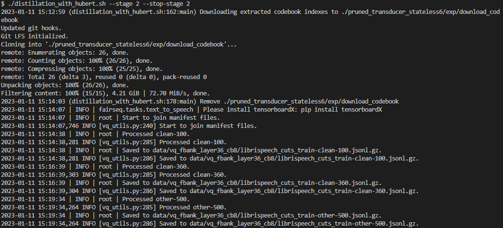
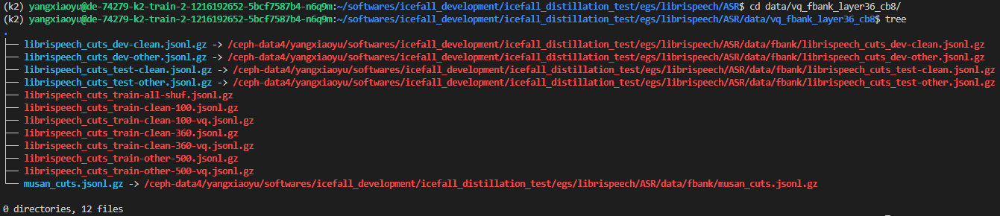

Distillation with HuBERT
========================

This tutorial shows you how to perform knowledge distillation in `icefall <https://github.com/k2-fsa/icefall>`_
with the `LibriSpeech`_ dataset. The distillation method
used here is called "Multi Vector Quantization Knowledge Distillation" (MVQ-KD).
Please have a look at our paper `Predicting Multi-Codebook Vector Quantization Indexes for Knowledge Distillation <https://arxiv.org/abs/2211.00508>`_
for more details about MVQ-KD.

.. note::

    This tutorial is based on recipe
    `pruned_transducer_stateless4 <https://github.com/k2-fsa/icefall/tree/master/egs/librispeech/ASR/pruned_transducer_stateless4>`_.
    Currently, we only implement MVQ-KD in this recipe. However, MVQ-KD is theoretically applicable to all recipes
    with only minor changes needed. Feel free to try out MVQ-KD in different recipes. If you
    encounter any problems, please open an issue here `icefall <https://github.com/k2-fsa/icefall/issues>`__.

.. note::

  We assume you have read the page :ref:`install icefall` and have setup
  the environment for `icefall`_.

.. HINT::

  We recommend you to use a GPU or several GPUs to run this recipe.

Data preparation
----------------

We first prepare necessary training data for `LibriSpeech`_.
This is the same as in :ref:`non_streaming_librispeech_pruned_transducer_stateless`.

.. hint::

   The data preparation is the same as other recipes on LibriSpeech dataset,
   if you have finished this step, you can skip to :ref:`codebook_index_preparation` directly.

.. code-block:: bash

  $ cd egs/librispeech/ASR
  $ ./prepare.sh

The script ``./prepare.sh`` handles the data preparation for you, **automagically**.
All you need to do is to run it.

The data preparation contains several stages, you can use the following two
options:

  - ``--stage``
  - ``--stop_stage``

to control which stage(s) should be run. By default, all stages are executed.

For example,

.. code-block:: bash

  $ cd egs/librispeech/ASR
  $ ./prepare.sh --stage 0 --stop_stage 0 # run only stage 0
  $ ./prepare.sh --stage 2 --stop_stage 5 # run from stage 2 to stage 5

.. HINT::

  If you have pre-downloaded the `LibriSpeech`_
  dataset and the `musan`_ dataset, say,
  they are saved in ``/tmp/LibriSpeech`` and ``/tmp/musan``, you can modify
  the ``dl_dir`` variable in ``./prepare.sh`` to point to ``/tmp`` so that
  ``./prepare.sh`` won't re-download them.

.. NOTE::

  All generated files by ``./prepare.sh``, e.g., features, lexicon, etc,
  are saved in ``./data`` directory.

We provide the following YouTube video showing how to run ``./prepare.sh``.

.. note::

   To get the latest news of `next-gen Kaldi <https://github.com/k2-fsa>`_, please subscribe
   the following YouTube channel by `Nadira Povey <https://www.youtube.com/channel/UC_VaumpkmINz1pNkFXAN9mw>`_:

      `<https://www.youtube.com/channel/UC_VaumpkmINz1pNkFXAN9mw>`_

..  youtube:: ofEIoJL-mGM

.. _codebook_index_preparation:

Codebook index preparation
--------------------------

Here, we prepare necessary data for MVQ-KD. This requires the generation
of codebook indexes (please read our `paper <https://arxiv.org/abs/2211.00508>`_.
if you are interested in details). In this tutorial, we use the pre-computed
codebook indexes for convenience. The only thing you need to do is to
run `./distillation_with_hubert.sh <https://github.com/k2-fsa/icefall/blob/master/egs/librispeech/ASR/distillation_with_hubert.sh>`_.

.. note::

  There are 5 stages in total, the first and second stage will be automatically skipped
  when choosing to downloaded codebook indexes prepared by `icefall`_.
  Of course, you can extract and compute the codebook indexes by yourself. This
  will require you downloading a HuBERT-XL model and it can take a while for
  the extraction of codebook indexes.

As usual, you can control the stages you want to run by specifying the following
two options:

  - ``--stage``
  - ``--stop_stage``

For example,

.. code-block:: bash

  $ cd egs/librispeech/ASR
  $ ./distillation_with_hubert.sh --stage 0 --stop_stage 0 # run only stage 0
  $ ./distillation_with_hubert.sh --stage 2 --stop_stage 4 # run from stage 2 to stage 5

Here are a few options in `./distillation_with_hubert.sh <https://github.com/k2-fsa/icefall/blob/master/egs/librispeech/ASR/distillation_with_hubert.sh>`_
you need to know before you proceed.

- ``--full_libri`` If True, use full 960h data. Otherwise only ``train-clean-100`` will be used
- ``--use_extracted_codebook`` If True, the first two stages will be skipped and the codebook
  indexes uploaded by us will be downloaded.

Since we are using the pre-computed codebook indexes, we set
``use_extracted_codebook=True``. If you want to do full `LibriSpeech`_
experiments, please set ``full_libri=True``.

The following command downloads the pre-computed codebook indexes
and prepares MVQ-augmented training manifests.

.. code-block:: bash

  $ ./distillation_with_hubert.sh --stage 2 --stop_stage 2 # run only stage 2

Please see the
following screenshot for the output of an example execution.

  Downloading codebook indexes and preparing training manifest.

.. hint::

  The codebook indexes we prepared for you in this tutorial
  are extracted from the 36-th layer of a fine-tuned HuBERT-XL model
  with 8 codebooks. If you want to try other configurations, please
  set ``use_extracted_codebook=False`` and set ``embedding_layer`` and
  ``num_codebooks`` by yourself.

Now, you should see the following files under the directory ``./data/vq_fbank_layer36_cb8``.

  MVQ-augmented training manifests.

Whola! You are ready to perform knowledge distillation training now!

Training
--------

To perform training, please run stage 3 by executing the following command.

.. code-block:: bash

  $ ./prepare.sh --stage 3 --stop_stage 3 # run MVQ training

Here is the code snippet for training:

.. code-block:: bash

  WORLD_SIZE=$(echo ${CUDA_VISIBLE_DEVICES} | awk '{n=split($1, _, ","); print n}')

  ./pruned_transducer_stateless6/train.py \
    --manifest-dir ./data/vq_fbank_layer36_cb8 \
    --master-port 12359 \
    --full-libri $full_libri \
    --spec-aug-time-warp-factor -1 \
    --max-duration 300 \
    --world-size ${WORLD_SIZE} \
    --num-epochs 30 \
    --exp-dir $exp_dir \
    --enable-distillation True \
    --codebook-loss-scale 0.01

There are a few training arguments in the following
training commands that should be paid attention to.

  - ``--enable-distillation`` If True, knowledge distillation training is enabled.
  - ``--codebook-loss-scale`` The scale of the knowledge distillation loss.
  - ``--manifest-dir`` The path to the MVQ-augmented manifest.

Decoding
--------

After training finished, you can test the performance on using
the following command.

.. code-block:: bash

  export CUDA_VISIBLE_DEVICES=0
  ./pruned_transducer_stateless6/train.py \
    --decoding-method "modified_beam_search" \
    --epoch 30 \
    --avg 10 \
    --max-duration 200 \
    --exp-dir $exp_dir \
    --enable-distillation True

You should get similar results as `here <https://github.com/k2-fsa/icefall/blob/master/egs/librispeech/ASR/RESULTS-100hours.md#distillation-with-hubert>`__.

That's all! Feel free to experiment with your own setups and report your results.
If you encounter any problems during training, please open up an issue `here <https://github.com/k2-fsa/icefall/issues>`__.
