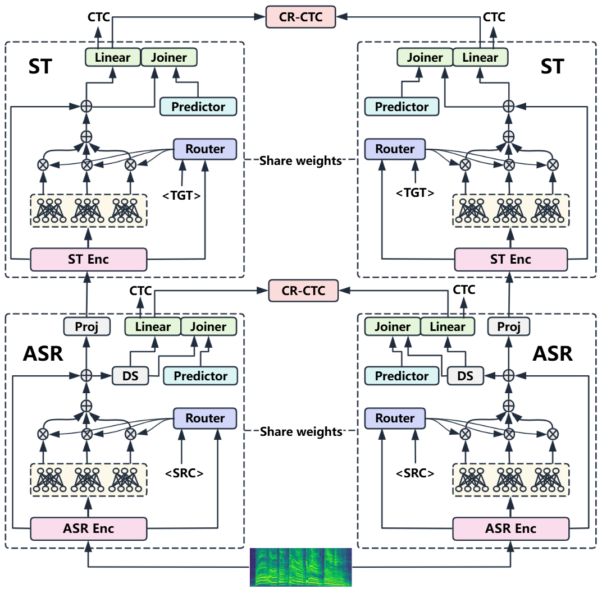

# LCMA-SRT: Language-Conditional Mixture-of-Experts Adapters for Joint Multilingual Speech Recognition and Translation

[](LICENSE)
[](https://aclanthology.org/2026.acl-long.1634/)

Neural transducers offer an alignment-free framework for speech-to-text modeling, and hierarchical transducer architectures further improve multilingual joint automatic speech recognition (ASR) and speech translation (ST) by stacking a translation-focused encoder on top of an ASR encoder. However, extending hierarchical transducers to multilingual many-to-many settings remains challenging: fully shared models often suffer from negative transfer and unstable target-language generation, while training separate models for each direction is computationally prohibitive. We propose LCMA-SRT (Language-Conditional Mixture-of-Experts Adapters for Speech Recognition and Translation), which augments a hierarchical transducer with language-conditional Mixture-of-Experts (MoE) adapters. A source-conditioned MoE adapter (SRC-MoE) uses source-language embeddings to reduce cross-language interference and improve multilingual ASR. A target-conditioned MoE adapter (TGT-MoE) uses the desired target language to reduce cross-target interference and stabilize target-language generation in many-to-many ST. Experiments on Europarl-ST (9 languages, 72 directions) show that LCMA-SRT improves both ASR and ST within a single joint model, reducing average WER and improving BLEU and COMET over strong hierarchical transducer baselines.



## Installation

Please refer to the [icefall installation guide](https://k2-fsa.github.io/icefall/installation/index.html).

## Data Preparation

Download the Europarl-ST dataset from the [official page](https://www.mllp.upv.es/europarl-st/).

See [local](local) for data preparation scripts.

## Training

### Stage 1: Multilingual ASR Pretraining

```bash
bash lcma_srt/train/stage1/cr_ctc_sc_moe.sh
```

### Stage 2: Many-to-Many Joint Training

```bash
bash lcma_srt/train/stage2/lcma_srt.sh
```

## Decoding

### Stage 1: ASR Decoding

```bash
bash lcma_srt/decode/stage1/decode_cr_ctc_sc_moe.sh
```

### Stage 2: Joint ASR+ST Decoding

```bash
bash lcma_srt/decode/stage2/decode_lcma_srt.sh
```

## Checkpoint

Pre-trained model checkpoints are available on [Hugging Face](https://huggingface.co/linanjie0820/lcma-srt).

## Main Results

### Multilingual ASR Pretraining

<table>
  <thead>
    <tr>
      <th rowspan="2">Model</th>
      <th colspan="10">WER (%) ↓</th>
    </tr>
    <tr>
      <th>de</th><th>en</th><th>es</th><th>fr</th><th>it</th>
      <th>nl</th><th>pl</th><th>pt</th><th>ro</th><th>Avg</th>
    </tr>
  </thead>
  <tbody>
    <tr>
      <td>CR-CTC</td>
      <td>24.57</td><td>18.59</td><td>20.76</td><td>19.24</td><td>17.33</td>
      <td>36.75</td><td>25.28</td><td>19.82</td><td>18.77</td><td>22.35</td>
    </tr>
    <tr>
      <td>&nbsp;&nbsp;&nbsp;+ MoE</td>
      <td>24.39</td><td>18.41</td><td>20.16</td><td>18.61</td><td>17.28</td>
      <td>36.83</td><td>24.36</td><td>19.70</td><td>18.79</td><td>22.06</td>
    </tr>
    <tr>
      <td>&nbsp;&nbsp;&nbsp;+ S-Bias</td>
      <td>23.89</td><td>17.60</td><td>19.58</td><td>17.41</td><td>16.73</td>
      <td><strong>34.72</strong></td><td>23.63</td><td>18.21</td><td>17.97</td><td>21.08</td>
    </tr>
    <tr>
      <td>&nbsp;&nbsp;&nbsp;+ SRC-MoE</td>
      <td><strong>23.34</strong></td><td><strong>17.45</strong></td><td><strong>19.41</strong></td>
      <td><strong>17.34</strong></td><td><strong>16.27</strong></td><td>35.20</td>
      <td><strong>23.28</strong></td><td><strong>18.16</strong></td><td><strong>17.48</strong></td>
      <td><strong>20.88</strong></td>
    </tr>    
  </tbody>
</table>

### Many-to-Many Joint Training (Average)

<table>
  <thead>
    <tr>
      <th rowspan="2">Model</th>
      <th rowspan="2">WER (%)↓</th>
      <th colspan="10">Average BLEU ↑</th>
    </tr>
    <tr>
      <th>de</th><th>en</th><th>es</th><th>fr</th><th>it</th><th>nl</th><th>pl</th><th>pt</th><th>ro</th><th>Avg</th>
    </tr>
  </thead>
  <tbody>
    <tr>
      <td>HENT-SRT-M20×9</td>
      <td>23.28</td>
      <td>10.7</td><td>21.2</td><td>19.1</td><td>18.2</td><td>14.2</td><td>16.5</td><td>7.2</td><td>18.4</td><td>12.1</td><td>15.3</td>
    </tr>
    <tr>
      <td>HENT-SRT-M2M</td>
      <td>16.65</td>
      <td>2.6</td><td>12.8</td><td>5.5</td><td>4.0</td><td>1.8</td><td>3.5</td><td>1.2</td><td>4.9</td><td>2.5</td><td>4.3</td>
    </tr>
    <tr>
      <td>LCMA-SRT</td>
      <td><strong>15.71</strong></td>
      <td><strong>15.2</strong></td><td><strong>25.9</strong></td><td><strong>25.8</strong></td><td><strong>24.7</strong></td>
      <td><strong>20.0</strong></td><td><strong>20.5</strong></td><td><strong>10.7</strong></td><td><strong>23.9</strong></td><td><strong>17.6</strong></td><td><strong>20.5</strong></td>
    </tr>
  </tbody>
</table>

<table>
  <thead>
    <tr>
      <th rowspan="2">Model</th>
      <th rowspan="2">LMR (%)↓</th>
      <th colspan="10">Average COMET ↑</th>
    </tr>
    <tr>
      <th>de</th><th>en</th><th>es</th><th>fr</th><th>it</th><th>nl</th><th>pl</th><th>pt</th><th>ro</th><th>Avg</th>
    </tr>
  </thead>
  <tbody>
    <tr>
      <td>HENT-SRT-M20×9</td>
      <td>0.65</td>
      <td>0.507</td><td>0.656</td><td>0.587</td><td>0.542</td><td>0.565</td><td>0.558</td><td>0.550</td><td>0.609</td><td>0.598</td><td>0.575</td>
    </tr>
    <tr>
      <td>HENT-SRT-M2M</td>
      <td>84.95</td>
      <td>0.380</td><td>0.543</td><td>0.478</td><td>0.427</td><td>0.435</td><td>0.401</td><td>0.385</td><td>0.471</td><td>0.406</td><td>0.436</td>
    </tr>
    <tr>
      <td>LCMA-SRT</td>
      <td>0.75</td>
      <td><strong>0.574</strong></td><td><strong>0.715</strong></td><td><strong>0.682</strong></td><td><strong>0.627</strong></td>
      <td><strong>0.656</strong></td><td><strong>0.613</strong></td><td><strong>0.616</strong></td><td><strong>0.693</strong></td><td><strong>0.678</strong></td><td><strong>0.651</strong></td>
    </tr>
  </tbody>
</table>

For complete per-direction results (all 72 directions), see [RESULTS.md](RESULTS.md).

## Evaluation

We use BLEU for surface-level matching, COMET for semantic adequacy, and sentence-level target-language mismatch rate (LMR) using an off-the-shelf language identification [model](https://dl.fbaipublicfiles.com/fasttext/supervised-models/lid.176.bin), where a hypothesis is counted as matched only if it is classified as the specified target language with confidence >= 0.7. ASR performance is assessed using word error rate (WER).

## Citation

If this project is useful for your research, please cite:

```bibtex
@inproceedings{li2026lcma,
  title={LCMA-SRT: Language-Conditional Mixture-of-Experts Adapters for Joint Multilingual Speech Recognition and Translation},
  author={Li, Nanjie and Guo, Xiaoyong and Huang, Hao and Haihua, Xu and Shi, Wei},
  booktitle={Proceedings of the 64th Annual Meeting of the Association for Computational Linguistics (Volume 1: Long Papers)},
  pages={35363--35377},
  year={2026}
}
```

## License

This project is licensed under the Apache License 2.0 - see the [LICENSE](LICENSE) file for details.
