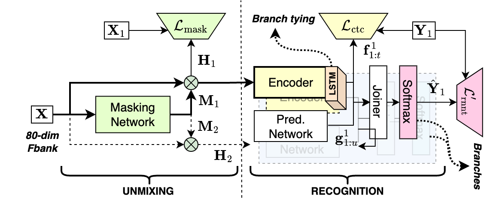
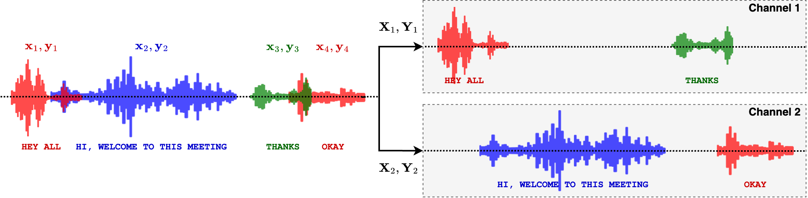

# Introduction

This is a multi-talker ASR recipe for the LibriCSS dataset. We train a Streaming
Unmixing and Recognition Transducer (SURT) model for the task. In this README,
we will describe the task, the model, and the training process. We will also
provide links to pre-trained models and training logs.

## Task

LibriCSS is a multi-talker meeting corpus formed from mixing together LibriSpeech utterances
and replaying in a real meeting room. It consists of 10 1-hour sessions of audio, each
recorded on a 7-channel microphone. The sessions are recorded at a sampling rate of 16 kHz.
For more information, refer to the paper:
Z. Chen et al., "Continuous speech separation: dataset and analysis,"
ICASSP 2020 - 2020 IEEE International Conference on Acoustics, Speech and Signal Processing (ICASSP),
Barcelona, Spain, 2020

In this recipe, we perform the "continuous, streaming, multi-talker ASR" task on LibriCSS.

* By "continuous", we mean that the model should be able to transcribe unsegmented audio
without the need of an external VAD.
* By "streaming", we mean that the model has limited right context. We use a right-context
of at most 32 frames (320 ms).
* By "multi-talker", we mean that the model should be able to transcribe overlapping speech
from multiple speakers.

For now, we do not care about speaker attribution, i.e., the transcription is speaker
agnostic. The evaluation depends on the particular model type. In this case, we use
the optimal reference combination WER (ORC-WER) metric as implemented in the
[meeteval](https://github.com/fgnt/meeteval) toolkit.

## Model

We use the Streaming Unmixing and Recognition Transducer (SURT) model for this task.
The model is based on the papers:

- Lu, Liang et al. “Streaming End-to-End Multi-Talker Speech Recognition.” IEEE Signal Processing Letters 28 (2020): 803-807.
- Raj, Desh et al. “Continuous Streaming Multi-Talker ASR with Dual-Path Transducers.” ICASSP 2022 - 2022 IEEE International Conference on Acoustics, Speech and Signal Processing (ICASSP) (2021): 7317-7321.

The model is a combination of a speech separation model and a speech recognition model,
but trained end-to-end with a single loss function. The overall architecture is shown
in the figure below. Note that this architecture is slightly different from the one
in the above papers. A detailed description of the model can be found in the following
paper: [SURT 2.0: Advanced in transducer-based multi-talker ASR](https://arxiv.org/abs/2306.10559).

<p align="center">

  
  Streaming Unmixing and Recognition Transducer

</p>

In the [dprnn_zipformer](./dprnn_zipformer) recipe, for example, we use a DPRNN-based masking network
and a Zipfomer-based recognition network. But other combinations are possible as well.

## Training objective

We train the model using the pruned transducer loss, similar to other ASR recipes in
icefall. However, an important consideration is how to assign references to the output
channels (2 in this case). For this, we use the heuristic error assignment training (HEAT)
strategy, which assigns references to the first available channel based on their start
times. An illustrative example is shown in the figure below:

<p align="center">

  
  Illustration of HEAT-based reference assignment.

</p>

## Description of the recipe

### Pre-requisites

The recipes in this directory need the following packages to be installed:

- [meeteval](https://github.com/fgnt/meeteval)
- [einops](https://github.com/arogozhnikov/einops)

Additionally, we initialize the "recognition" transducer with a pre-trained model,
trained on LibriSpeech. For this, please run the following from within `egs/librispeech/ASR`:

```bash
./prepare.sh

export CUDA_VISIBLE_DEVICES="0,1,2,3"
python pruned_transducer_stateless7_streaming/train.py \
    --use-fp16 True \
    --exp-dir pruned_transducer_stateless7_streaming/exp \
    --world-size 4 \
    --max-duration 800 \
    --num-epochs 10 \
    --keep-last-k 1 \
    --manifest-dir data/manifests \
    --enable-musan true \
    --master-port 54321 \
    --bpe-model data/lang_bpe_500/bpe.model \
    --num-encoder-layers 2,2,2,2,2 \
    --feedforward-dims 768,768,768,768,768 \
    --nhead 8,8,8,8,8 \
    --encoder-dims 256,256,256,256,256 \
    --attention-dims 192,192,192,192,192 \
    --encoder-unmasked-dims 192,192,192,192,192 \
    --zipformer-downsampling-factors 1,2,4,8,2 \
    --cnn-module-kernels 31,31,31,31,31 \
    --decoder-dim 512 \
    --joiner-dim 512
```

The above is for SURT-base (~26M). For SURT-large (~38M), use `--num-encoder-layers 2,4,3,2,4`.

Once the above model is trained for 10 epochs, copy it to `egs/libricss/SURT/exp`:

```bash
cp -r pruned_transducer_stateless7_streaming/exp/epoch-10.pt exp/zipformer_base.pt
```

**NOTE:** We also provide this pre-trained checkpoint (see the section below), so you can skip
the above step if you want.

### Training

To train the model, run the following from within `egs/libricss/SURT`:

```bash
export CUDA_VISIBLE_DEVICES="0,1,2,3"

python dprnn_zipformer/train.py \
    --use-fp16 True \
    --exp-dir dprnn_zipformer/exp/surt_base \
    --world-size 4 \
    --max-duration 500 \
    --max-duration-valid 250 \
    --max-cuts 200 \
    --num-buckets 50 \
    --num-epochs 30 \
    --enable-spec-aug True \
    --enable-musan False \
    --ctc-loss-scale 0.2 \
    --heat-loss-scale 0.2 \
    --base-lr 0.004 \
    --model-init-ckpt exp/zipformer_base.pt \
    --chunk-width-randomization True \
    --num-mask-encoder-layers 4 \
    --num-encoder-layers 2,2,2,2,2
```

The above is for SURT-base (~26M). For SURT-large (~38M), use:

```bash
    --num-mask-encoder-layers 6 \
    --num-encoder-layers 2,4,3,2,4 \
    --model-init-ckpt exp/zipformer_large.pt \
```

**NOTE:** You may need to decrease the `--max-duration` for SURT-large to avoid OOM.

### Adaptation

The training step above only trains on simulated mixtures. For best results, we also
adapt the final model on the LibriCSS dev set. For this, run the following from within
`egs/libricss/SURT`:

```bash
export CUDA_VISIBLE_DEVICES="0"

python dprnn_zipformer/train_adapt.py \
    --use-fp16 True \
    --exp-dir dprnn_zipformer/exp/surt_base_adapt \
    --world-size 1 \
    --max-duration 500 \
    --max-duration-valid 250 \
    --max-cuts 200 \
    --num-buckets 50 \
    --num-epochs 8 \
    --lr-epochs 2 \
    --enable-spec-aug True \
    --enable-musan False \
    --ctc-loss-scale 0.2 \
    --base-lr 0.0004 \
    --model-init-ckpt dprnn_zipformer/exp/surt_base/epoch-30.pt \
    --chunk-width-randomization True \
    --num-mask-encoder-layers 4 \
    --num-encoder-layers 2,2,2,2,2
```

For SURT-large, use the following config:

```bash
    --num-mask-encoder-layers 6 \
    --num-encoder-layers 2,4,3,2,4 \
    --model-init-ckpt dprnn_zipformer/exp/surt_large/epoch-30.pt \
    --num-epochs 15 \
    --lr-epochs 4 \
```


### Decoding

To decode the model, run the following from within `egs/libricss/SURT`:

#### Greedy search

```bash
export CUDA_VISIBLE_DEVICES="0"

python dprnn_zipformer/decode.py \
    --epoch 8 --avg 1 --use-averaged-model False \
    --exp-dir dprnn_zipformer/exp/surt_base_adapt \
    --max-duration 250 \
    --decoding-method greedy_search
```

#### Beam search

```bash
python dprnn_zipformer/decode.py \
    --epoch 8 --avg 1 --use-averaged-model False \
    --exp-dir dprnn_zipformer/exp/surt_base_adapt \
    --max-duration 250 \
    --decoding-method modified_beam_search \
    --beam-size 4
```

## Results (using beam search)

#### IHM-Mix

| Model | # params | 0L | 0S | OV10 | OV20 | OV30 | OV40 | Avg. |
|------------|:-------:|:----:|:---:|----:|:----:|:----:|:----:|:----:|
| dprnn_zipformer (base)  | 26.7 | 5.1 | 4.2 | 13.7 | 18.7 | 20.5 | 20.6 | 13.8 |
| dprnn_zipformer (large) | 37.9 | 4.6 | 3.8 | 12.7 | 14.3 | 16.7 | 21.2 | 12.2 |

#### SDM

| Model | # params | 0L | 0S | OV10 | OV20 | OV30 | OV40 | Avg. |
|------------|:-------:|:----:|:---:|----:|:----:|:----:|:----:|:----:|
| dprnn_zipformer (base)  | 26.7 | 6.8 | 7.2 | 21.4 | 24.5 | 28.6 | 31.2 | 20.0 |
| dprnn_zipformer (large) | 37.9 | 6.4 | 6.9 | 17.9 | 19.7 | 25.2 | 25.5 | 16.9 |

## Pre-trained models and logs

* Pre-trained models: <https://huggingface.co/desh2608/icefall-surt-libricss-dprnn-zipformer>

* Training logs:
    - surt_base: <https://tensorboard.dev/experiment/YLGJTkBETb2aqDQ61jbxvQ/>
    - surt_base_adapt: <https://tensorboard.dev/experiment/pjXMFVL9RMej85rMHyd0EQ/>
    - surt_large: <https://tensorboard.dev/experiment/82HvYqfrSOKZ4w8Jod2QMw/>
    - surt_large_adapt: <https://tensorboard.dev/experiment/5oIdEgRqS9Wb6yVuxaExEw/>
