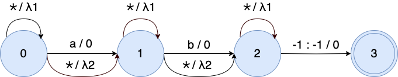

# Introduction

This is a weakly supervised ASR recipe for the LibriSpeech (clean 100 hours) dataset. We train a
conformer model using [Bypass Temporal Classification](https://arxiv.org/pdf/2306.01031.pdf) (BTC)/[Omni-temporal Classification](https://arxiv.org/pdf/2309.15796.pdf) (OTC) with transcripts with synthetic errors. In this README, we will describe
the task and the BTC/OTC training process.

Note that OTC is an extension of BTC and supports all BTC functions. Therefore, in the following, we only describe OTC.
## Task
We propose BTC/OTC to directly train an ASR system leveraging weak supervision, i.e., speech with non-verbatim transcripts. This is achieved by using a special token $\star$ to model uncertainties (i.e., substitution errors, insertion errors, and deletion errors) 
within the WFST framework during training.


<div style="display: flex;flex; justify-content: space-between">
  <figure style="flex: 2; text-align: center; margin: 5px;">
    

  </figure>
  <figure style="flex: 2; text-align: center; margin: 5px;">
    

  </figure>
  <figure style="flex: 2; text-align: center;margin: 5px;">
    

  </figure>
</div>
<figcaption> Examples of errors (substitution, insertion, and deletion) in the transcript. The grey box is the verbatim transcript and the red box is the inaccurate transcript. Inaccurate words are marked in bold.</figcaption> <br><br>


We modify $G(\mathbf{y})$ by adding self-loop arcs into each state and bypass arcs into each arc. 
  <p align="center">
    

  </p>

We incorporate the penalty strategy and apply different configurations for the self-loop arc and bypass arc. The penalties are set as

$$\lambda_{1_{i}} = \beta_{1} * \tau_{1}^{i},\quad \lambda_{2_{i}} = \beta_{2} * \tau_{2}^{i}$$

for the $i$-th training epoch. $\beta$ is the initial penalty that encourages the model to rely more on the given transcript at the start of training. 
It decays exponentially by a factor of $\tau \in (0, 1)$, gradually encouraging the model to align speech with $\star$ when getting confused. 

After composing the modified WFST $G_{\text{otc}}(\mathbf{y})$ with $L$ and $T$, the OTC training graph is shown in this figure:
<figure style="text-align: center">
  
  <figcaption>OTC training graph. The self-loop arcs and bypass arcs are highlighted in green and blue, respectively.</figcaption>
</figure>

The $\star$ is represented as the average probability of all non-blank tokens.
  <p align="center">
    
  </p>

The weight of $\star$ is the log average probability of "a" and "b": $\log \frac{e^{-1.2} + e^{-2.3}}{2} = -1.6$ and $\log \frac{e^{-1.9} + e^{-0.5}}{2} = -1.0$ for 2 frames.

## Description of the recipe
### Preparation
```
# feature_type can be ssl or fbank
feature_type=ssl
feature_dir="data/${feature_type}"
manifest_dir="${feature_dir}"
lang_dir="data/lang"
lm_dir="data/lm"
exp_dir="conformer_ctc2/exp"
otc_token="<star>"

./prepare.sh \
  --feature-type "${feature_type}" \
  --feature-dir "${feature_dir}" \
  --lang-dir "${lang_dir}" \
  --lm-dir "${lm_dir}" \
  --otc-token "${otc_token}" 
```
This script adds the 'otc_token' ('\<star\>') and its corresponding sentence-piece ('▁\<star\>') to 'words.txt' and 'tokens.txt,' respectively. Additionally, it computes SSL features using the 'wav2vec2-base' model. (You can use GPU to accelerate feature extraction).

### Making synthetic errors to the transcript (train-clean-100) [optional]
```
sub_er=0.17
ins_er=0.17
del_er=0.17
synthetic_train_manifest="librispeech_cuts_train-clean-100_${sub_er}_${ins_er}_${del_er}.jsonl.gz"

./local/make_error_cutset.py \
  --input-cutset "${manifest_dir}/librispeech_cuts_train-clean-100.jsonl.gz" \
  --words-file "${lang_dir}/words.txt" \
  --sub-error-rate "${sub_er}" \
  --ins-error-rate "${ins_er}" \
  --del-error-rate "${del_er}" \
  --output-cutset "${manifest_dir}/${synthetic_train_manifest}"
```
This script generates synthetic substitution, insertion, and deletion errors in the transcript with ratios 'sub_er', 'ins_er', and 'del_er', respectively. The original transcript is saved as 'verbatim transcript' in the cutset, along with information on how the transcript is corrupted:

  - '[hello]' indicates the original word 'hello' is substituted by another word
  - '[]' indicates an extra word is inserted into the transcript
  - '-hello-' indicates the word 'hello' is deleted from the transcript
  
So if the original transcript is "have a nice day" and the synthetic one is "a very good day", the 'verbatim transcript' would be:
```
original:  have  a      nice  day
synthetic:       a very good  day
verbatim: -have- a  [] [nice] day
```

### Training
The training uses synthetic data based on the train-clean-100 subset.
```
otc_lang_dir=data/lang_bpe_200

allow_bypass_arc=true
allow_self_loop_arc=true
initial_bypass_weight=-19
initial_self_loop_weight=3.75
bypass_weight_decay=0.975
self_loop_weight_decay=0.999

show_alignment=true

export CUDA_VISIBLE_DEVICES="0,1,2,3"
./conformer_ctc2/train.py \
  --world-size 4 \
  --manifest-dir "${manifest_dir}" \
  --train-manifest "${synthetic_train_manifest}" \
  --exp-dir "${exp_dir}" \
  --lang-dir "${otc_lang_dir}" \
  --otc-token "${otc_token}" \
  --allow-bypass-arc "${allow_bypass_arc}" \
  --allow-self-loop-arc "${allow_self_loop_arc}" \
  --initial-bypass-weight "${initial_bypass_weight}" \
  --initial-self-loop-weight "${initial_self_loop_weight}" \
  --bypass-weight-decay "${bypass_weight_decay}" \
  --self-loop-weight-decay "${self_loop_weight_decay}" \
  --show-alignment "${show_alignment}"
```
The bypass arc deals with substitution and insertion errors, while the self-loop arc deals with deletion errors. Using "--show-alignment" would print the best alignment during training, which is very helpful for tuning hyperparameters and debugging.

### Decoding
```
export CUDA_VISIBLE_DEVICES="0"
./conformer_ctc2/decode.py \
  --manifest-dir "${manifest_dir}" \
  --exp-dir "${exp_dir}" \
  --lang-dir "${otc_lang_dir}" \
  --lm-dir "${lm_dir}" \
  --otc-token "${otc_token}"
```

### Results (ctc-greedy-search)
<table>
  <tr>
    <td rowspan=2>Training Criterion</td>
    <td colspan=2>ssl</td>
    <td colspan=2>fbank</td>
  </tr>
  <tr>
    <td>test-clean</td>
    <td>test-other</td>
    <td>test-clean</td>
    <td>test-other</td>
  </tr>
  <tr>
    <td>CTC</td>
    <td>100.0</td>
    <td>100.0</td>
    <td>99.89</td>
    <td>99.98</td>
  </tr>
  <tr>
    <td>OTC</td>
    <td>11.89</td>
    <td>25.46</td>
    <td>20.14</td>
    <td>44.24</td>
  </tr>
</table>

### Results (1best, blank_bias=-4)
<table>
  <tr>
    <td rowspan=2>Training Criterion</td>
    <td colspan=2>ssl</td>
    <td colspan=2>fbank</td>
  </tr>
  <tr>
    <td>test-clean</td>
    <td>test-other</td>
    <td>test-clean</td>
    <td>test-other</td>
  </tr>
  <tr>
    <td>CTC</td>
    <td>98.40</td>
    <td>98.68</td>
    <td>99.79</td>
    <td>99.86</td>
  </tr>
  <tr>
    <td>OTC</td>
    <td>6.59</td>
    <td>15.98</td>
    <td>11.78</td>
    <td>32.38</td>
  </tr>
</table>

## Pre-trained Model
Pre-trained model: <https://huggingface.co/dgao/icefall-otc-librispeech-conformer-ctc2>

## Citations
```
@inproceedings{gao2023bypass,
  title={Bypass Temporal Classification: Weakly Supervised Automatic Speech Recognition with Imperfect Transcripts},
  author={Gao, Dongji and Wiesner, Matthew and Xu, Hainan and Garcia, Leibny Paola and Povey, Daniel and Khudanpur, Sanjeev},
  booktitle={INTERSPEECH},
  year={2023}
}

@inproceedings{gao2023learning,
  title={Learning from Flawed Data: Weakly Supervised Automatic Speech Recognition},
  author={Gao, Dongji and Xu, Hainan and Raj, Desh and Garcia, Leibny Paola and Povey, Daniel and Khudanpur, Sanjeev},
  booktitle={IEEE ASRU},
  year={2023}
}
```
