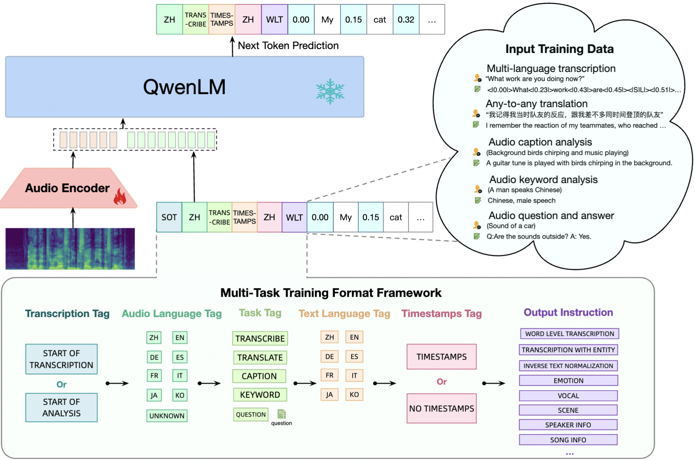

# Introduction

This recipe includes scripts for training [Qwen-Audio](https://github.com/QwenLM/Qwen-Audio/tree/main) style model using multiple datasets.

 

    

 

[./RESULTS.md](./RESULTS.md) contains the latest results.

# ASR_LLM

The following table lists the folders for different tasks.

|                                       | Speech Encoder             | LLM            | Comment                                           |
|---------------------------------------|---------------------|--------------------|---------------------------------------------------|
| [whisper_llm_zh](./whisper_llm_zh)                          | Whisper           | Qwen2               |  [Using multiple Chinese datasets](https://github.com/k2-fsa/icefall/tree/master/egs/multi_zh-hans/ASR)                                                 |
