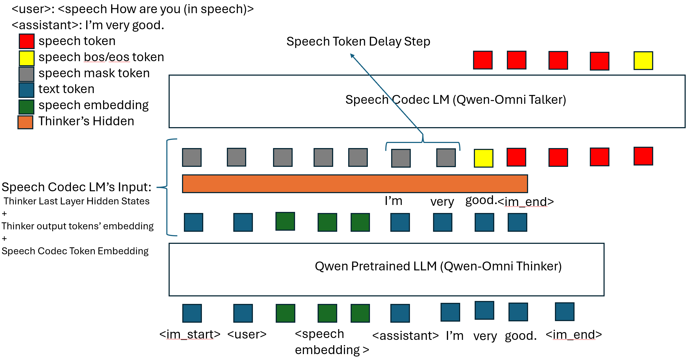

# Introduction

This recipe includes scripts for training speech2speech models.

# SPEECH2SPEECH

The following table lists the folders for different tasks.

|Recipe        | Speech Input | Speech Output | Comment|
|--------------|--------------|---------------|--------|
|Qwen-omni like| Continuous Embeddins| Cosyvoice1 50Hz Single-codebook Token | Text-driven; using Thinker LLM for text token, small Talker LLM for speech token |

### [Qwen-omni like Speech2speech Recipe](./qwen_omni)

[Qwen2.5-Omni](https://github.com/QwenLM/Qwen2.5-Omni) style model using [worstchan/Belle_1.4M-SLAM-Omni](https://huggingface.co/datasets/worstchan/Belle_1.4M-SLAM-Omni) dataset.

<br>
<p align="center">
    
<p>
<br>

Command for training is:
```bash
torchrun --nproc_per_node $ngpu ./qwen_omni/train.py \
    --max-duration 50 \
    --enable-musan False \
    --exp-dir $exp_dir \
    --speech-encoder-path-or-name models/whisper/v1.1/whisper-large-v2-multi-hans-zh-epoch-3-avg-10.pt \
    --llm-path-or-name Qwen/Qwen2.5-0.5B-Instruct \
    --manifest-dir data/fbank \
    --deepspeed \
    --deepspeed_config ./qwen_omni/ds_config_zero1.json \
    --use-flash-attn True \
    --use-lora True --unfreeze-llm True --unfreeze-speech-projector True --enable-speech-output True
```

Command for decoding is:
```bash
python3 ./qwen_omni/decode.py \
    --max-duration 1 \
    --exp-dir $exp_dir \
    --speech-encoder-path-or-name models/whisper/v1.1/whisper-large-v2-multi-hans-zh-epoch-3-avg-10.pt  \
    --llm-path-or-name models/Qwen2.5-0.5B-Instruct \
    --epoch 999 --avg 1 \
    --manifest-dir data/fbank \
    --use-flash-attn True \
    --method e2e-epoch10_speech2speech \
    --enable-speech-output True \
    --token2wav-path models/CosyVoice-300M-SFT \
    --use-lora True
```

Please see [`prepare.sh`](./prepare.sh) for more details.
