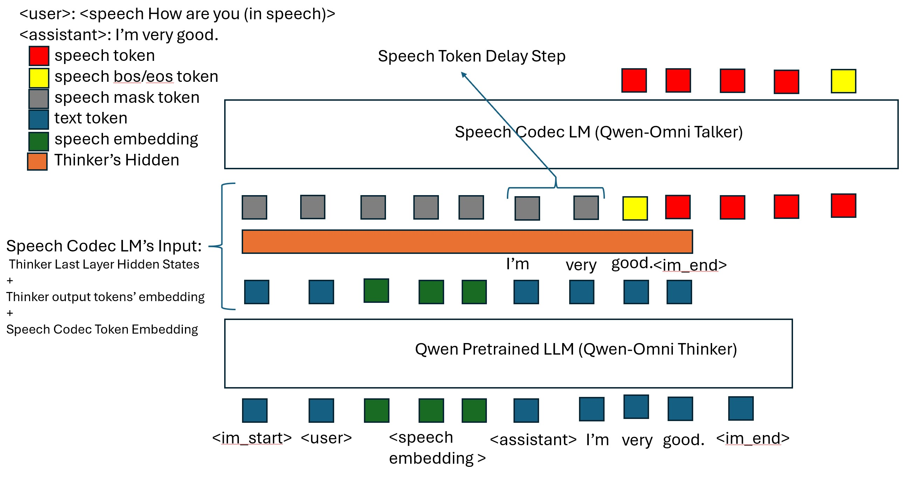

# Introduction

This recipe includes scripts for training speech2speech models.

# SPEECH2SPEECH

The following table lists the folders for different tasks.

|Recipe        | Speech Input | Speech Output | Comment|
|--------------|--------------|---------------|--------|
|Qwen-omni like| Continuous Embeddins| Cosyvoice1 50Hz Single-codebook Token | Text-driven; using Thinker LLM for text token, small Talker LLM for speech token |

### [Qwen-omni like Speech2speech Recipe](./qwen_omni)

[Qwen2.5-Omni](https://github.com/QwenLM/Qwen2.5-Omni) style model using [worstchan/Belle_1.4M-SLAM-Omni](https://huggingface.co/datasets/worstchan/Belle_1.4M-SLAM-Omni) dataset.

<br>
<p align="center">
    
<p>
<br>

Command for training is:
```bash
pip install -r whisper_llm_zh/requirements.txt

pip install huggingface_hub['cli']
mkdir -p models/whisper models/qwen

# For aishell fine-tuned whisper model
huggingface-cli download --local-dir models/whisper    yuekai/icefall_asr_aishell_whisper exp_large_v2/whisper-large-v2-aishell1-epoch-10-avg-6.pt
# For multi-hans fine-tuned whisper model
# huggingface-cli download --local-dir models/whisper    yuekai/icefall_asr_multi-hans-zh_whisper v1.1/whisper-large-v2-multi-hans-zh-epoch-3-avg-10.pt

# huggingface-clie download  --local-dir models/qwen     Qwen/Qwen2-7B-Instruct
huggingface-clie download  --local-dir models/qwen     Qwen/Qwen2-1.5B-Instruct

# First, we only train the projector and freeze other modules.
torchrun --nproc_per_node 8 ./whisper_llm_zh/train.py \
  --max-duration 200 \
  --exp-dir ./whisper_llm_zh/exp_test \
  --speech-encoder-path-or-name models/whisper/exp_large_v2/whisper-large-v2-aishell1-epoch-10-avg-6.pt \
  --llm-path-or-name Qwen/Qwen2-1.5B-Instruct \
  --manifest-dir data/fbank \
  --deepspeed \
  --deepspeed_config ./whisper_llm_zh/ds_config_zero1.json \
  --use-flash-attn True \
  --use-lora False --unfreeze-llm False

# Then we jointly train the projector and LLM LoRA modules.
torchrun --nproc_per_node 8 ./whisper_llm_zh/train.py \
  --max-duration 200 \
  --exp-dir ./whisper_llm_zh/exp_test \
  --speech-encoder-path-or-name models/whisper/exp_large_v2/whisper-large-v2-aishell1-epoch-10-avg-6.pt \
  --llm-path-or-name Qwen/Qwen2-1.5B-Instruct \
  --manifest-dir data/fbank \
  --deepspeed \
  --deepspeed_config ./whisper_llm_zh/ds_config_zero1.json \
  --use-flash-attn True \
  --use-lora True --unfreeze-llm True
  --pretrained-model-path ./whisper_llm_zh/exp_test/epoch-3.pt
```

Command for decoding:
```bash
mkdir -p models/whisper models/qwen models/checkpoint
huggingface-cli download --local-dir models/checkpoint yuekai/icefall_asr_aishell_whisper_qwen2_1.5B

# For aishell fine-tuned whisper model
huggingface-cli download --local-dir models/whisper    yuekai/icefall_asr_aishell_whisper exp_large_v2/whisper-large-v2-aishell1-epoch-10-avg-6.pt
# For multi-hans fine-tuned whisper model
# huggingface-cli download --local-dir models/whisper    yuekai/icefall_asr_multi-hans-zh_whisper v1.1/whisper-large-v2-multi-hans-zh-epoch-3-avg-10.pt

huggingface-clie download  --local-dir models/qwen     Qwen/Qwen2-7B-Instruct

mkdir -p whisper_llm_zh/exp_aishell_whisper_qwen2_1.5B
ln -s models/checkpoint/epoch-10-avg-5.pt whisper_llm_zh/exp_aishell_whisper_qwen2_1.5B/epoch-999.pt

python3 ./whisper_llm_zh/decode.py \
  --max-duration 80 \
  --exp-dir whisper_llm_zh/exp_aishell_whisper_qwen2_1.5B \
  --speech-encoder-path-or-name models/whisper/exp_large_v2/whisper-large-v2-aishell1-epoch-10-avg-6.pt  \
  --llm-path-or-name models/qwen \
  --epoch 999 --avg 1 \
  --manifest-dir data/fbank \
  --use-flash-attn True \
  --use-lora True --dataset aishell
```
