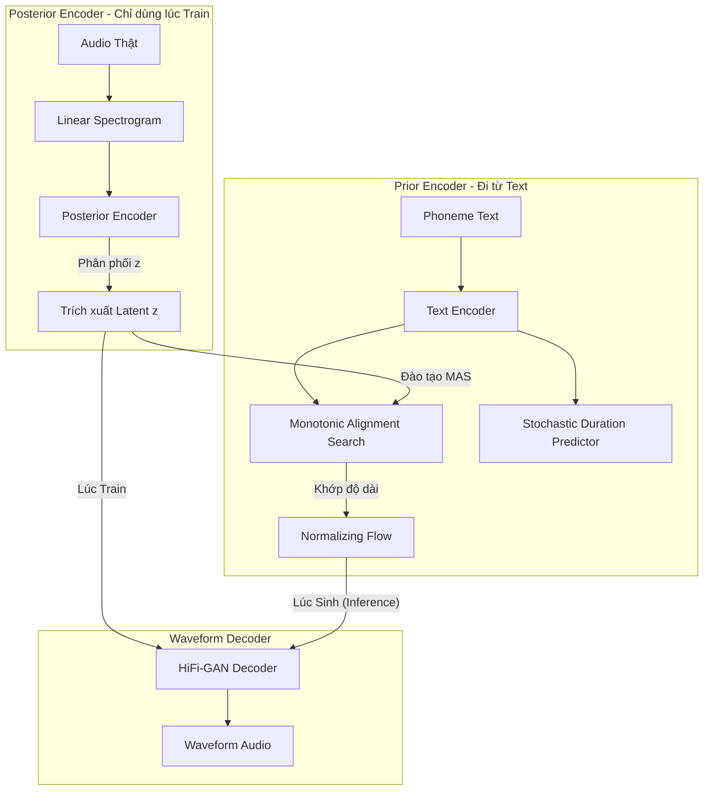

# VITS (Variational Inference with adversarial learning for end-to-end Text-to-Speech)

Tài liệu này giải thích các khái niệm kiến trúc, toán học và logic cốt lõi đằng sau mô hình VITS — một trong những mô hình State-of-the-Art (SOTA) trong lĩnh vực tổng hợp giọng nói.

---

## 1. Sự khác biệt của VITS: End-to-End từ Text thẳng ra Waveform

Trước thế hệ của VITS, quy trình TTS thường là một "đường ống" (pipeline) gồm 2 giai đoạn tách biệt:
1. **Acoustic Model** (Tacotron 2, FastSpeech): Biến **Text** thành **Mel-spectrogram** (dạng hình ảnh biểu diễn âm thanh tần số).
2. **Vocoder** (WaveNet, HiFi-GAN): Biến **Mel-spectrogram** thành **Waveform** (sóng âm thanh thô để phát ra loa).

**Nhược điểm của cách cũ:** Tích tụ lỗi (Error Accumulation). Nếu Acoustic Model dự đoán Spectrogram hơi mờ, Vocoder sẽ khuyếch đại cái "mờ" đó thành tiếng nhiễu (artifacts) hoặc tiếng robot.

🔥 **VITS giải quyết điều này bằng mô hình End-to-End:**
VITS kết nối trực tiếp Text và Waveform. Không có sự đứt gãy ở giữa. Thay vì bắt mô hình học cách tạo ra một Mel-spectrogram trung gian cứng nhắc, VITS học cách tạo ra một vùng tiềm ẩn (Latent Space) $z$. 
- Từ Text, mô hình **đoán** $z$.
- Từ $z$, mô hình **tạo thẳng** ra sóng âm thanh (Waveform).
- Nếu sóng âm thanh nghe không giống thật, mô hình tự động điều chỉnh cả bộ đoán $z$ từ Text và bộ tạo âm lượng. Toàn bộ hệ thống tự tối ưu cho nhau.

---

## 2. Luồng Logic (Architecture Flow)

**Hoạt động lúc Inference (Khi gọi `infer.py`):**
Text → Text Encoder → Normalizing Flow (biến đổi phân phối) → Decoder (sinh Waveform nhanh chóng).

---

## 3. Các nền tảng Toán học & Logic cốt lõi

VITS là sự kết hợp của 4 kỷ nguyên AI mạnh mẽ nhất:

### A. Variational Autoencoder (VAE)
VITS xây dựng dựa trên kỹ thuật biến thiên (Variational Inference).
- Thay vì dự đoán một giá trị chính xác, mô hình dự đoán một **phân phối xác suất** (thường là phân phối chuẩn Gaussian).
- **Posterior $q(z|x)$**: Khi có âm thanh thật, mô hình giải mã nó thành các tham số $\mu, \sigma$ của $z$.
- **Prior $p(z|c)$**: Khi có text (c), mô hình dựa vào chữ cái để đoán xem âm thanh $z$ có đặc tính phân phối nào.
- Trọng tâm của toán học ở đây là **Cực đại hóa ELBO (Evidence Lower Bound)**, rút ngắn lại là giảm thiểu **KL Divergence** giữa Posterior (âm thanh thật) và Prior (text). Ép cho việc đoán từ chữ phải giống như lúc nghe âm thanh thật.

### B. Normalizing Flows
Giọng nói con người có tính chất *One-to-Many* (Một câu nói có thể đọc trầm, bổng, vui vẻ, buồn bã). Phân phối chuẩn (Gaussian/chuông) là quá đơn giản để đại diện cho sự đa dạng này.
- **Normalizing Flows** là một chuỗi các hàm biến đổi toán học nghịch đảo (invertible functions) nhằm "nặn" một phân phối Gaussian cơ bản thành một phân phối cực kỳ phức tạp để hợp với giọng thật.
- Nó giúp Text Encoder từ một dự đoán "chung chung" trở thành một dự đoán có độ chi tiết rất cao về ngữ điệu (prosody).

### C. Stochastic Duration Predictor (Toán học dự đoán thời lượng)
Chữ 'A' có lúc đọc dài (Aaaaa), có lúc đọc ngắn (A). 
- Duration Predictor của VITS cũng dựa trên *Flow-based model* chứ không dự đoán một con số cứng nhắc dính liền với chữ. 
- Nó lấy Noise ngẫu nhiên kết hợp với Text để đẻ ra thời lượng nói một cách tự nhiên. Giúp câu nói nhịp nhàng như người thật (ngắt nghỉ random). Nó dùng MLE (Maximum Likelihood Estimation) để tối ưu.

### D. Monotonic Alignment Search (MAS)
Thuật toán tìm kiếm sự căn chỉnh **đơn điệu**.
- *Đơn điệu* nghĩa là thời gian luôn tiến tới: Bạn không thể phát âm chữ thứ 2 trước chữ thứ 1. 
- MAS sử dụng thuật toán **Dynamic Programming** (Quy hoạch động - giống với Viterbi ở mô hình HMM) để tìm ra đường liên kết (alignment path) xác suất cao nhất giữa dải Spectrogram (âm thanh) và chuỗi chữ cái (Text).
- Nhờ có MAS, VITS **không cần dữ liệu gán nhãn từng mili-giây** (không cần biết chữ "Xin" dài bao nhiêu giây). Mô hình sẽ tự học cách gập (align) qua các Epoch.

### E. Adversarial Training (Generative Adversarial Network - GAN)
Vì hàm Loss của VAE (Reconstruction Loss) có xu hướng làm âm thanh bị "mờ" và "đục", VITS dùng Decoder là một Generator của **HiFi-GAN**.
Nó setup trò chơi 2 phe:
1. **Decoder (Generator):** Tìm cách tạo âm thanh thô lừa hệ thống.
2. **Discriminator:** Cố phân biệt đâu là audio tổng hợp, đâu là audio từ ca sĩ/người đọc thật (thông qua Feature Matching Loss và LSGAN Loss).

> VITS chính thức chấm dứt sự phụ thuộc vào các đường ống phức tạp của TTS truyền thống, sử dụng VAE để có lý thuyết thống kê liền mạch, MAS để tự học cách nối chữ và âm thanh, và GAN để Waveform tạo ra nét cắt cực khét, trong trẻo.
